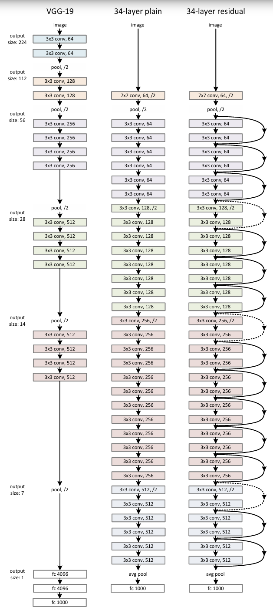
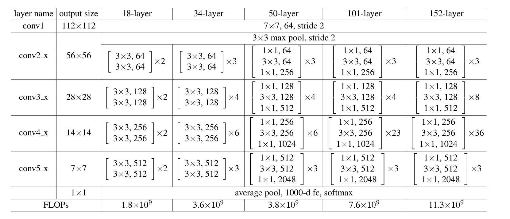
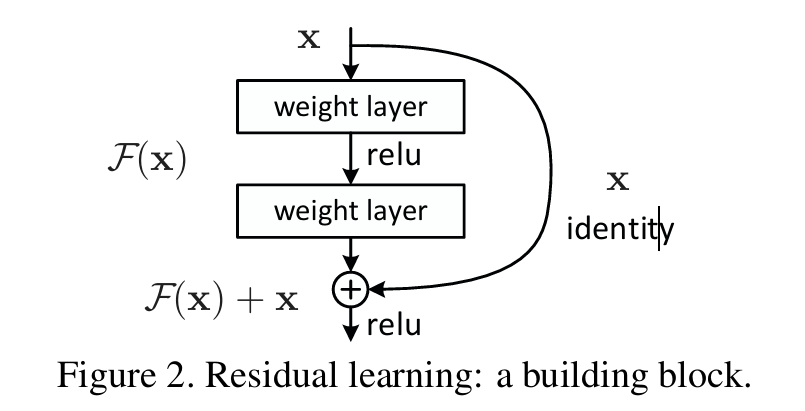
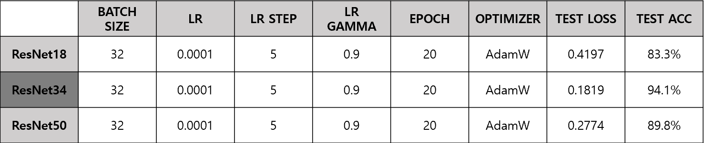

# Project Overview

## Animal Classification
I conducted a project to classify a total of 10 types of animals—Butterfly, Cat, Chicken, Cow, Dog, Elephant, Horse, Sheep, Spider, and Squirrel—using ResNet models.

The goal of our project was to determine which of the three models—ResNet18, ResNet34, and ResNet50—performed the best when all hyperparameters were set identically

The dataset used for training consisted of a total of 10,000 images, with 1,000 images per class. For validation and test data, 100 images per class were used, totaling 1,000 images each.

## Dataset Information

This project uses a dataset from Kaggle, but the dataset is not in this repository.
You can access and download the dataset from the following link : [Animals-10](https://www.kaggle.com/datasets/viratkothari/animal10).

---
## ResNet

### Residual Neural Network (ResNet)

ResNet is a deep learning model developed by Microsoft Research in 2015, and has demonstrated innovative performance in various computer vision tasks such as image classification.

ResNet's core idea is to introduce a **residual structure** to solve the problems of **gradient vanishing** and **degradation** that occur in the process of building layers in neural networks.

---

### ResNet Architecture (Image)

#### 1. VGG-19, 34-layer Plain, and 34-layer Residual

#### 2. Layer-wise ResNet Configuration

---

###  ResNet Structure

The core of ResNet is the **Residual Block**:
- **Residual Block** learns the transformation function \( F(x) \), and its output is calculated as:
  
\[
Output = F(x) + x
\]
- Each block consists of 2-3 convolution layers, and if needed, a **1×1 convolution** is used to match input and output dimensions.
- ResNet-50, 101, and 152 employ the **Bottleneck Structure** to improve efficiency:
- Bottleneck blocks reduce computation and improve learning speed by first reducing dimensions using a \( 1×1 \) layer, applying a \( 3×3 \) layer, and then restoring dimensions with another \( 1×1 \) layer.

---

### Depth of the Network

ResNet is designed to enable learning in **very deep networks**:
- Examples: **50, 101, 152 layers**, and even up to **1202 layers** on the CIFAR-10 dataset.
- Unlike traditional networks, ResNet overcomes the decline in performance that occurs as the depth increases. Instead, it achieves **better performance with deeper networks**.
- This demonstrates that ResNet operates effectively even at extreme depths, which traditional deep learning models struggle to achieve.

---

###  Residual Learning

ResNet introduces a new learning method:
- Instead of directly learning \( H(x) \), the network learns:
  \[
  F(x) = H(x) - x
  \]
- The original function is reconstructed as:
  \[
  H(x) = F(x) + x
  \]
- This reformulation makes it easier for the network to find an **optimal solution close to identity mapping**.  
- As a result, ResNet simplifies optimization and enables learning of deeper networks compared to traditional methods.
- 

---

###  Skip Connection

**Skip Connection** is a critical component of ResNet:
- It **adds input data directly to the output** by skipping several layers.
- **Key roles**:
  1. **Mitigates Gradient Vanishing Problems**: Helps propagate signals effectively during backpropagation.
  2. **Provides Additional Optimization Paths**: Facilitates convergence even in very deep networks.  
- Skip connections are based on **Identity Mapping** and add **no additional parameters**, ensuring computational efficiency.
---

## conclusion
As a result, the ResNet34 model achieved the highest performance with an accuracy of 94.1%.

## References
* Kaiming He, Xiangyu Zhang, Shaoqing Ren, Jian Sun. *Deep Residual Learning for Image Recognition*. CVPR, 2016. [Paper](https://arxiv.org/abs/1512.03385)
* Model Code by hyukppen

